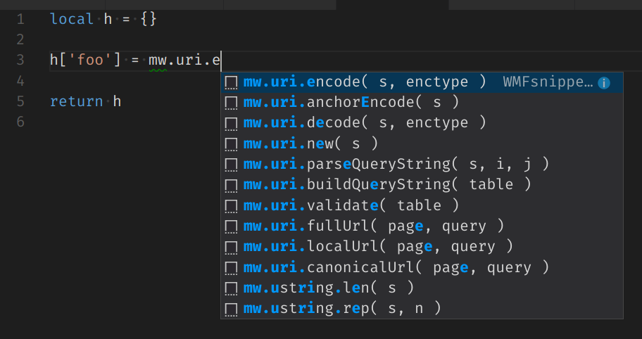

# Lua snippets for Wikimedia

This extension for Visual Studio Code adds snippets for various languages in use by Wikimedia at its sites running [MediaWiki](http://www.mediawiki.org) software. Among those languages are Lua, which is used as a templating language by the [Scribunto extension](https://www.mediawiki.org/wiki/Extension:Scribunto).

## Usage

Type part of a snippet, typically by writing something like `mw.ustring.byte`, make sure the highlighted entry is the one you want, press `tab` or `enter`, and the snippet unfolds. Inside the snippet there are one or more highlighted areas, these can be replaced, and it is then possible to tab to next item that can be replaced. Sometimes the highlighted area cover the comma before the argument, that happen when the following is an optional argument.

The snippets have a prefix that is the method name, and inside Visual Studio Code you might type additionel specifiers. Those are typically the class name or the name of an argument. It is also possible to write the snippets number, even if it is a bit awkward. Instance methods are found the same way as class methods, but the leading part is skipped on the assumption that it shall be appended to a variable of some sort.

As this is snippets, there is no Intellisense available. This is a bit unfortunate, as the user must learn the method names. They do although work as a typing aid, and especially well as an aid to get the arguments right.

## Libraries

The set of snippets are mostly motivated by what I (the author) have found usefull, so please don't expect the list to be complete!

### Lua

Standard libraries

- [os](src/lua/os.json) static library; os operations (only time-date functions)
- [package](src/lua/package.json) static library; package operations
- [string](src/lua/string.json) static library; string operations

Scribunto libraries

- [mw](src/lua/mw.json) static library; basic functions from Scribunto to interface with Mediawiki
  - [frame](src/lua/frame.json) static library; interactions with calls from Mediawiki
  - [hash](src/lua/hash.json) static library; basic hashing
  - [html](src/lua/html.json) static library; create and manipulate html tags
  - [language](src/lua/language.json) static library; get, create and manipulate language objects
  - [uri](src/lua/uri.json) static library; create and manipulate encoded uri strings
  - [ustring](src/lua/ustring.json) static library; manipulate unicode strings
  - [title](src/lua/title.json) static library; get, create and manipulate title objects

Loadable libraries

- [bit32](src/lua/but32.json) loadable library; bit operations
- [libraryUtil](src/lua/libraryUtil.json) loadable library; manipulate arguments

Unfinished standard libraries

- debug library
- math library
- table library

Unfinished Scribunto libraries

- message library (mixed library and object); as an object it can't be properly identified unless intellisense works for Lua
- site library; this is a proper library imported as default and can be properly identified by prefix alone
- text library; this is a proper library imported as default and can be properly identified by prefix alone

## Installation

1. Install Visual Studio Code 0.10.1 or higher
1. Launch `code`
1. From the command palette `Ctrl`-`Shift`-`P` (Windows, Linux) or `Cmd`-`Shift`-`P` (OSX)
1. Select `Install Extension`
1. Choose the extension
1. Reload Visual Studio Code
